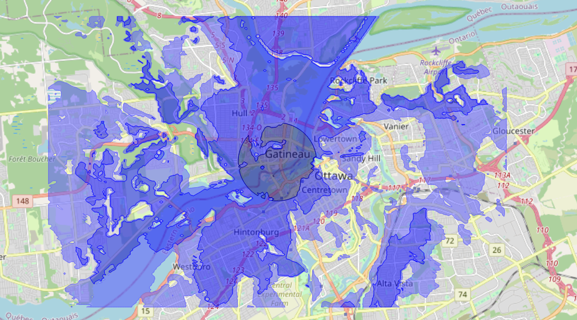

[Français](./README_FR.md)

# crc-covlib
Software library for radiowave coverage and interference prediction.

- [Introduction](#introduction)
- [Installing ITU data files](#installing-itu-data-files)
- [Using crc-covlib from python](#using-crc-covlib-from-python)
- [Using crc-covlib as a Windows DLL or a Linux library file](#using-crc-covlib-as-a-windows-dll-or-a-linux-library-file)
- [Building crc-covlib](#building-crc-covlib)
  - [On Windows](#on-windows)
  - [On Linux](#on-linux)


## Introduction

crc-covlib is a software library written in C++ for radiowave coverage and interference prediction using a few different propagation models. It may be used under both Windows and Linux. A [python-wrapper](./python-wrapper/) is also available in order to easily invoke crc-covlib from the python programming language. It was designed to facilitate to use of propagation models, it may generate a full coverage simulation with little lines of code! 

crc-covlib includes the following functionalities:
* Selection between **propagation models**:  free space, [Longley-Rice](https://its.ntia.gov/research-topics/radio-propagation-software/itm/itm.aspx), [ITU-R P.1812-7](https://www.itu.int/rec/R-REC-P.1812/en), [ITU-R P.452-17](https://www.itu.int/rec/R-REC-P.452/en), [ITU-R P.452-18](https://www.itu.int/rec/R-REC-P.452/en), [Extended-Hata](https://its.ntia.gov/about-its/archive/2017/its-open-sources-the-extended-hata-urban-propagation-model.aspx), [CRC-MLPL](https://arxiv.org/abs/2405.10006) and [CRC Path Obscura](https://arxiv.org/abs/2501.08306), the last two being machine learning-based path loss models developed at the [Communications Research Centre Canada](https://ised-isde.canada.ca/site/communications-research-centre-canada/en). Also available are the terrestrial statistical clutter loss model from Annex 1, section 3.2 of [ITU-R P.2108-1](https://www.itu.int/rec/R-REC-P.2108/en), the building entry loss model from Annex 1 of [ITU-R P.2109-2](https://www.itu.int/rec/R-REC-P.2109/en) and the gaseous attenuation model for terrestrial paths from Annex 1, sections 1 and 2.1 of [ITU-R P.676-13](https://www.itu.int/rec/R-REC-P.676-13-202208-I/en).
* Support for reading a few different types of **terrain elevation files** at user-defined sampling resolution, mainly the Canadian Digital Elevation Model (CDEM), the Medium Resolution Digital Elevation Model (MRDEM DTM) and the High-Resolution Digital Terrain Model (HRDEM DTM) from Natural Resources Canada. Other GeoTIFF files may also be supported depending on the coordinate system being used (WSG84 is supported for **worldwide** locations).
* Support for reading **land cover files** from the European Space Agency (ESA) WorldCover project, as well as from the Land Cover of Canada product from Natural Resources Canada. GeoTIFF files may also be supported depending on the coordinate system being used (WSG84 is supported for **worldwide** locations).
* Support for reading **surface elevation files**, mainly the Canadian Digital Surface Model (CDSM), the Medium Resolution Digital Surface Model (MRDEM DSM) and the the High-Resolution Digital Surface Model (HRDEM DSM) from Natural Resources Canada. Other GeoTIFF files may also be supported depending on the coordinate system being used (WSG84 is supported for **worldwide** locations). File format from the Shuttle Radar Topography Mission (SRTM) digital elevation model is also supported.
* Usage of a fallback data source when the main source for terrain elevation, land cover or surface elevation does not cover a given location. Error reporting for missing terrain data is available.
* Support for using **antenna patterns** for both terminals (transmitter and receiver). Elevation angle calculation for using vertical antenna patterns is done using terrain elevation data. Antenna pointing azimuth may be fixed or relative to the other terminal's location.
* Simulation results as field strength (dBµV/m), path loss (dB), transmission loss (dB) or received power (dBm).
* Point-to-area simulation results exportable to text (\*.txt) and raster (\*.bil) formats. Contour drawings exportable in *.kml (Google Earth) and *.mif/mid (MapInfo) file formats.
* Results and terrain profiles (terrain elevation, land cover, etc.) exportable to *.csv format.
* Other python-only functionalities are available on top of the main core functionalities (C++ implementation) listed above, including additional implementation of ITU recommendations (terrestrial and non-terrestrial propagation). For more details please see the [crc_covlib package documentation](./python-wrapper/README.md#crc_covlib-package-documentation) section.

<p align = "center">

</p>
<p align = "center">
Fig.1 - Contours produced by crc-covlib, displayed using <a href="https://qgis.org/en/site/">QGIS</a> over an OpenStreetMap layer
</p>


## Installing ITU data files

crc-covlib uses digital maps and other data files that are publicly accessible from the [International Telecommunication Union](https://www.itu.int/en/Pages/default.aspx) (ITU) website. These files are not redistibutable but they can be easily obtained by running the `install_ITU_data.py` python script that will take care of downloading them from the official source. The script's default installation option gets files used by both the C++ core implementation and the additional python-only functionalities. If you only intent to use the core functionalities mentioned above, you may select the minimal install option instead. 

The ITU data files are for personal use only. You may install them from a command prompt with:
```bash
py install_ITU_data.py       # on Windows
python3 install_ITU_data.py  # on Linux
```


## Using crc-covlib from python

To use crc-covlib from python, please see the python-wrapper [readme file](./python-wrapper/README.md).

Python code examples are available in the [python-wrapper/examples](./python-wrapper/examples/) folder.


## Using crc-covlib as a Windows DLL or a Linux library file

The [dist](./dist/) folder contains the latest compiled version of crc-covlib for the Windows environment. It includes the following files:

* CRC-COVLIB.h (C++ header file to include in the C++ project that is using crc-covlib)
* crc-covlib.dll (Windows dynamic link library file)
* crc-covlib.lib (import library file for crc-covlib.dll)

For the Linux environment, a dynamic library file (libcrc-covlib.so) and a static library file (libcrc-covlib.a) can be built by following the [instructions below](#on-linux).

C++ client code examples are available in the [examples](./examples/) folder.

For more details, please see the [API reference document](./docs/CRC-COVLIB%20API%20Reference.pdf).

## Building crc-covlib

### On Windows

** NOTE: The following steps are not required in order to use crc-covlib on Windows from both C++ and python, as the required binary is already included in this repository. **

On Windows `crc-covlib.dll` is currently compiled using [MinGW](https://www.mingw-w64.org/). MinGW can be easily installed via [MSYS2](https://www.msys2.org/). After completing the install instructions from MSYS2's website, install the following toolset from the MSYS2 UCRT64 command prompt:
```
pacman -S mingw-w64-ucrt-x86_64-toolchain
```
Then install [LibTIFF](http://libtiff.maptools.org/) and [GeographicLib](https://geographiclib.sourceforge.io/) development files from the same command prompt:
```
pacman -S mingw-w64-ucrt-x86_64-libtiff
pacman -S mingw-w64-ucrt-x86_64-geographiclib
```

Open a Windows command prompt as Administrator and create a symbolic link for the `make` tool using the following (_note: adjust directories if default directory values were changed during MSYS2's installation_):
```
mklink C:\msys64\ucrt64\bin\make.exe C:\msys64\ucrt64\bin\mingw32-make.exe
```

Optionally, the following directories may be added (_note: again adjust directories if default directory values were changed during MSYS2's installation_) to the `PATH` environment variable in order to make `g++` and `make` invocable from the Windows command prompt. Otherwise, the MSYS2 UCRT64 command prompt can be used to invoke `g++` and `make`.
```
C:\msys64\ucrt64\bin
C:\msys64\usr\bin
```
Finally, use the `make` command from the directory containing the [Makefile](./Makefile) in order to build the DLL:
```
make rebuild
```

Note: make sure to [update your MSYS2 installation](https://www.msys2.org/docs/updating/) from time to time by running the  `pacman -Suy` command **twice** from the MSYS2 MSYS command prompt.

### On Linux

On Linux the usual GNU Toolchain can be used for the build process. Before building crc-covlib, make sure that [LibTIFF](http://libtiff.maptools.org/) and [GeographicLib](https://geographiclib.sourceforge.io/) development files are installed (commands may vary depending on the Linux distribution and installed package manager):
```bash
# On Ubuntu and derivatives
sudo apt install libtiff-dev
sudo apt install libgeographiclib-dev # note: if libgeographiclib-dev is not available, try with libgeographic-dev instead

# On CentOS, Amazon Linux 2
sudo yum install libtiff-devel
sudo yum install GeographicLib-devel
```

Finally, use the `make` command from the directory containing the [Makefile](./Makefile) in order to build the library files (`libcrc-covlib.so` and `libcrc-covlib.a`):
```
make rebuild
```
