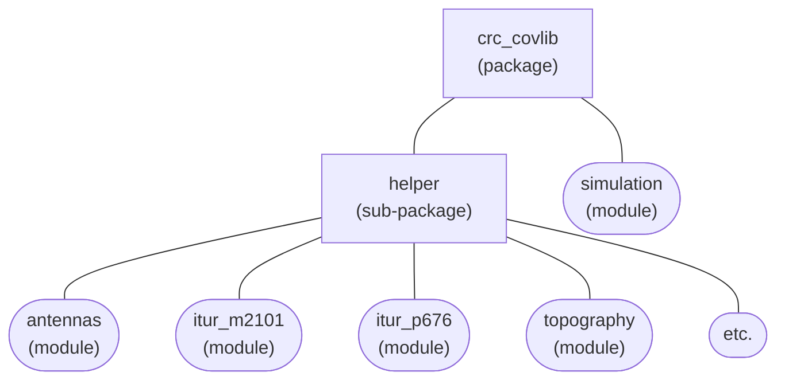

[Français](./README_FR.md)

# Python wrapper for crc-covlib
Use crc-covlib from python.

- [How to use](#how-to-use)
- [Code snippet](#code-snippet)
- [crc_covlib package documentation](#crc_covlib-package-documentation)
- [crc_covlib.helper sub-package API documentation](./docs/readme.md)

## How to use

**Under Linux, the first step** is to build the `libcrc-covlib.so` file by following [this procedure](../README.md#on-linux). Upon building, the `libcrc-covlib.so` file will be automatically copied into the `crc_covlib` package folder. This building step **is not required under Windows** since a version of the corresponding library file (`crc-covlib.dll`) is already provided.

If you have not already done so, **the next step** is to install the ITU data files by running the `install_ITU_data.py` script. For more details, see [Installing ITU data files](../README.md#installing-itu-data-files).

Finally, there are a few different options you may choose from in order to use crc-covlib.

**A first option** is to copy the `crc_covlib` folder and its content next to the script that will use crc-covlib (let's call it `myscript.py`). Python should then be able to find crc-covlib from a simple import statement, as shown below.
```bash
├── myscript.py
├── crc_covlib/
```
```python
# content of myscript.py
from crc_covlib import simulation as covlib

if __name__ == '__main__':
    sim = covlib.Simulation()
    ...
```

**A second option**, if you prefer to place the `crc_covlib` folder in a different directory than the one containing `myscript.py`, is as shown below. In this case, the path to the `crc_covlib` folder needs to be specified in `myscript.py`. This is the technique employed in the scripts from the [python-wrapper/examples](./examples) folder.
```bash
├── myscript.py
├── packages/
│   └── crc_covlib/
```
```python
# content of myscript.py
import sys, os
script_dir = os.path.dirname(os.path.abspath(__file__))     # get this script's directory
sys.path.insert(0, os.path.join(script_dir, './packages/')) # specify location of crc_covlib relatively to this script
from crc_covlib import simulation as covlib

if __name__ == '__main__':
    sim = covlib.Simulation()
    ...
```

**A third option** is to install the `crc_covlib` package on your system. You will then be able to use crc-covlib irrespectively of `myscript.py`'s location. Run the command(s) below to install/uninstall the `crc_covlib` package on your system.

```bash
# Install the crc_covlib package (from the directory containing pyproject.toml and crc_covlib/)
py -m pip install .       # on Windows 
python3 -m pip install .  # on Linux 

# Alternately for advanced users, the crc_covlib package may be installed using the -e option.
# This may be useful if you want to avoid the package files (including the ITU data files
# that may take much space) to be copied to a different location on disk.
py -m pip install -e .       # on Windows
python3 -m pip install -e .  # on Linux

# Uninstall the crc_covlib package
py -m pip uninstall crc_covlib       # on Windows
python3 -m pip uninstall crc_covlib  # on Linux

# Check if the crc_covlib package is already installed
py -m pip show crc_covlib       # on Windows
python3 -m pip show crc_covlib  # on Linux
```
```python
# content of myscript.py
from crc_covlib import simulation as covlib

if __name__ == '__main__':
    sim = covlib.Simulation()
    ...
```

## Code snippet

The following example generates path loss results using the Longley-Rice propagation model and CDEM (Canadian Digital Elevation Model) terrain data. Other crc-covlib usage examples are available in the [python-wrapper/examples](./examples) folder.

```python
import sys
sys.path.insert(0, 'C:/dev/crc-covlib/python-wrapper')
from crc_covlib import simulation as covlib

if __name__ == '__main__':
    sim = covlib.Simulation()

    sim.SetTransmitterLocation(45.42531, -75.71573)
    sim.SetTransmitterHeight(30)
    sim.SetTransmitterFrequency(2600)

    sim.SetPropagationModel(covlib.PropagationModel.LONGLEY_RICE)

    # Specify location of terrain elevation data files to use with Longley-Rice 
    CDEM = covlib.TerrainElevDataSource.TERR_ELEV_NRCAN_CDEM
    sim.SetPrimaryTerrainElevDataSource(CDEM)
    sim.SetTerrainElevDataSourceDirectory(CDEM, 'C:/dev/crc-covlib/data/terrain-elev-samples/NRCAN_CDEM')
    sim.SetTerrainElevDataSamplingResolution(25)

    sim.SetResultType(covlib.ResultType.PATH_LOSS_DB)

    # Single reception point simulation
    loss_dB = sim.GenerateReceptionPointResult(45.38, -75.85)
    print('path loss at (lat=45.38, lon=-75.85): {} dB'.format(loss_dB))

    # Path profile simulation
    sim.ExportProfilesToCsvFile('path-loss-profile.csv', 45.38, -75.85)

    # Point-to-area simulation
    sim.SetReceptionAreaCorners(45.37914, -75.81922, 45.47148, -75.61225)
    sim.GenerateReceptionAreaResults()
    sim.ExportReceptionAreaResultsToBilFile('path-loss-area.bil')
```

## crc_covlib package documentation

Core crc-covlib functionalities (C++ implementation) are accessible in python through the _simulation_ module (`crc_covlib.simulation`). For more details, please see the [API reference document](../docs/CRC-COVLIB%20API%20Reference.pdf). Even though the document is written for C++, the `crc_covlib.simulation` module practically uses the same class, method and argument names.

Some additional python-only functionalities on top of those provided by crc-covlib's core implementation in C++ are available through the _helper_ sub-package (`crc_covlib.helper`).

crc-covlib's _helper_ functionalities include:
* Reading antenna pattern files.
* Displaying antenna patterns (polar, cartesian, 3D), using [_matplotlib_](https://matplotlib.org/).
* Generating beamforming antenna patterns in accordance with the [ITU-R M.2101-0](https://www.itu.int/rec/R-REC-M.2101/en) recommendation (Section 5).
* Reading a wide variety of georeferenced raster file types to obtain topographic data for crc-covlib simulations, using [_Rasterio_](https://rasterio.readthedocs.io/en/latest/index.html) and [_NumPy_](https://numpy.org/).
* Providing partial implementations for different ITU recommendations with fast code execution using [_Numba_](https://numba.pydata.org/) \
(_Note: usage of Numba may be disabled by editing the `config.DISABLE_JIT` variable in the \_\_init\_\_.py file of the crc_covlib/helper/ directory_).
  - [ITU-R P.453-14](https://www.itu.int/rec/R-REC-P.453/en) (The radio refractive index: its formula and refractivity data)
  - [ITU-R P.528-5](https://www.itu.int/rec/R-REC-P.528/en) (A propagation prediction method for aeronautical mobile and radionavigation services using the VHF, UHF and SHF bands	 )
  - [ITU-R P.530-18](https://www.itu.int/rec/R-REC-P.530/en) (Propagation data and prediction methods required for the design of terrestrial line-of-sight systems)
  - [ITU-R P.618-14](https://www.itu.int/rec/R-REC-P.618/en) (Propagation data and prediction methods required for the design of Earth-space telecommunication systems)
  - [ITU-R P.619-5](https://www.itu.int/rec/R-REC-P.619/en) (Propagation data required for the evaluation of interference between stations in space and those on the surface of the Earth)
  - [ITU-R P.676-13](https://www.itu.int/rec/R-REC-P.676/en) (Attenuation by atmospheric gases and related effects)
  - [ITU-R P.835-6](https://www.itu.int/rec/R-REC-P.835/en) (Reference standard atmospheres)
  - [ITU-R P.837-7](https://www.itu.int/rec/R-REC-P.837/en) (Characteristics of precipitation for propagation modelling)
  - [ITU-R P.838-3](https://www.itu.int/rec/R-REC-P.838/en) (Specific attenuation model for rain for use in prediction methods)
  - [ITU-R P.839-4](https://www.itu.int/rec/R-REC-P.839/en) (Rain height model for prediction methods)
  - [ITU-R P.840-9](https://www.itu.int/rec/R-REC-P.840/en) (Attenuation due to clouds and fog)
  - [ITU-R P.1511-3](https://www.itu.int/rec/R-REC-P.1511/en) (Topography for Earth-space propagation modelling)
  - [ITU-R P.2001-5](https://www.itu.int/rec/R-REC-P.2001/en) (A general purpose wide-range terrestrial propagation model in the frequency range 30 MHz to 50 GHz)
  - [ITU-R P.2108-1](https://www.itu.int/rec/R-REC-P.2108/en) (Prediction of clutter loss)
  - [ITU-R P.2109-2](https://www.itu.int/rec/R-REC-P.2109/en) (Prediction of building entry loss)
  - [ITU-R P.2145-0](https://www.itu.int/rec/R-REC-P.2145/en) (Digital maps related to the calculation of gaseous attenuation and related effects)

### Package architecture diagram



For more details, see the [helper sub-package API documentation](./docs/readme.md).