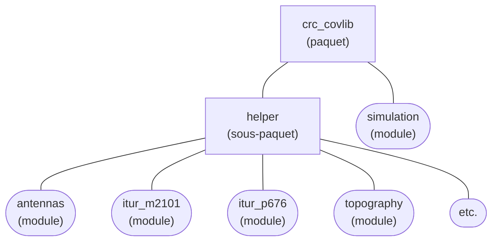

[English](./README.md)

# Enveloppe logicielle python pour crc-covlib

Utilisation de  crc-covlib en python.

- [Comment faire](#comment-faire)
- [Extrait de code](#extrait-de-code)
- [Documentation du paquet crc_covlib](#documentation-du-paquet-crc_covlib)
- [Documentation du sous-paquet crc_covlib.helper (API)](./docs/readme.md)

## Comment faire

**Sous Linux, la première étape** consiste à générer le fichier `libcrc-covlib.so` en suivant [cette procédure](../README_FR.md#sous-linux) qui se chargera également de copier le fichier généré sous le répertoire `crc_covlib`. Cette étape **n'est pas nécessaire sous Windows** puisque la version correspondante du fichier (`crc-covlib.dll`) est fournie.

Si ce n'est déjà fait, **la prochaine étape** consiste à installer les fichiers de données de l'UIT en exécutant le script `install_ITU_data.py`. Pour plus de détails, voir la section [Installation des fichiers de données de l'UIT](../README_FR.md#installation-des-fichiers-de-données-de-luit).

Finalement, pour l'utilisation de crc-covlib comme tel, quelques options différentes sont possibles.

**Une première option** possible consiste à copier le répertoire `crc_covlib` et son contenu sous le répertoire hébergeant le script python qui fera appel à crc-covlib (appelons-le `monscript.py`). L'interpréteur python sera alors en mesure de trouver crc-covlib suivant une simple déclaration d'import tel que montré ci-dessous.
```bash
├── monscript.py
├── crc_covlib/
```
```python
# contenu de monscript.py
from crc_covlib import simulation as covlib

if __name__ == '__main__':
    sim = covlib.Simulation()
    ...
```

**Une deuxième option**, si vous préférez avoir le répertoire `crc_covlib` dans un répertoire différent de celui hébergeant `monscript.py`, est montré ci-bas. Pour cette option, l'emplacement du répertoire `crc_covlib` doit être spécifié à l'intérieur de `monscript.py`. Ceci est la technique employée dans les scripts d'exemples en python se trouvant sous le répertoire [python-wrapper/examples](./examples).
```bash
├── monscript.py
├── mes_paquets_python/
│   └── crc_covlib/
```
```python
# contenu de monscript.py
import sys, os
script_dir = os.path.dirname(os.path.abspath(__file__)) # répertoire contenant le script courant
sys.path.insert(0, os.path.join(script_dir, './mes_paquets_python/')) # spécification de l'emplacement de crc_covlib relativement au script courant
from crc_covlib import simulation as covlib

if __name__ == '__main__':
    sim = covlib.Simulation()
    ...
```

**Une troisième option** consiste à installer le paquet `crc_covlib` au système courant. Il sera ensuite facile d'utiliser crc-covlib peu importe son emplacement par rapport à `monscript.py`. Pour ce faire, vous pouvez utiliser les commandes suivantes.
```bash
# Installation du paquet crc_covlib
# (à invoquer à partir du répertoire contenant pyproject.toml et crc_covlib/)
py -m pip install .       # sous Windows
python3 -m pip install .  # sous Linux

# Une alternative pour les utilisateurs avancés est de faire l'installation avec l'option -e.
# Ceci permet d'éviter la copie des fichiers contenus dans le répertoire crc_covlib (incluant
# les fichiers de données de l'UIT qui peuvent prendre beaucoup d'espace) à un autre répertoire.
py -m pip install -e .       # sous Windows
python3 -m pip install -e .  # sous Linux

# Désinstallation du paquet crc_covlib
py -m pip uninstall crc_covlib       # sous Windows
python3 -m pip uninstall crc_covlib  # sous Linux

# Pour vérifier si le paquet crc_covlib est déjà installé
py -m pip show crc_covlib       # sous Windows
python3 -m pip show crc_covlib  # sous Linux
```
```python
# contenu de monscript.py
from crc_covlib import simulation as covlib

if __name__ == '__main__':
    sim = covlib.Simulation()
    ...
```

## Extrait de code

L'exemple de code suivant calcule les pertes de propagation en utilisant le modèle Longley-Rice ainsi que des données d'élévation de terrain CDEM («Canadian Digital Elevation Model»). D'autres exemples d'utilisation de crc-covlib sont disponibles sous le répertoire [python-wrapper/examples](./examples).

```python
import sys
sys.path.insert(0, 'C:/dev/crc-covlib/python-wrapper')
from crc_covlib import simulation as covlib

if __name__ == '__main__':
    sim = covlib.Simulation()

    sim.SetTransmitterLocation(45.42531, -75.71573)
    sim.SetTransmitterHeight(30)
    sim.SetTransmitterFrequency(2600)

    sim.SetPropagationModel(covlib.PropagationModel.LONGLEY_RICE)

    # Spécification de l'emplacement des données d'élévation du terrain 
    CDEM = covlib.TerrainElevDataSource.TERR_ELEV_NRCAN_CDEM
    sim.SetPrimaryTerrainElevDataSource(CDEM)
    sim.SetTerrainElevDataSourceDirectory(CDEM, 'C:/dev/crc-covlib/data/terrain-elev-samples/NRCAN_CDEM')
    sim.SetTerrainElevDataSamplingResolution(25)

    sim.SetResultType(covlib.ResultType.PATH_LOSS_DB)

    # Calcul de pertes point à point
    loss_dB = sim.GenerateReceptionPointResult(45.38, -75.85)
    print('path loss at (lat=45.38, lon=-75.85): {} dB'.format(loss_dB))

    # Calcul de pertes en différents points le long du trajet allant de l'émetteur au récepteur
    sim.ExportProfilesToCsvFile('path-loss-profile.csv', 45.38, -75.85)

    # Calcul de pertes point à zone
    sim.SetReceptionAreaCorners(45.37914, -75.81922, 45.47148, -75.61225)
    sim.GenerateReceptionAreaResults()
    sim.ExportReceptionAreaResultsToBilFile('path-loss-area.bil')
```

## Documentation du paquet crc_covlib

Les fonctionnalités de base (implémentation en C++) de crc-covlib sont accessibles en python par l'intermédiaire du module _simulation_ (`crc_covlib.simulation`). Les détails de ces fonctionnalités sont décrites le document d'[interface de programmation (API)](../docs/CRC-COVLIB%20API%20Reference.pdf) (anglais seulement). Bien que ce document soit écrit pour le langage C++, le module python `crc_covlib.simulation` utilise exactement les mêmes noms de classes, d'énumérations, de méthodes et d'arguments.

Certaines fonctionnalités additionnelles écrites en python et qui viennent complémenter les fonctionnalités de base écrites en C++ sont disponibles par l'intermédiaire du sous-paquet _helper_ (`crc_covlib.helper`).

Les fonctionnalités du sous-paquet _helper_ incluent:
* La lecture de fichiers de patrons d'antenne.
* L'affichage de patrons d'antenne (en coordonnées polaires, cartésiennes ou 3D) utilisant [_matplotlib_](https://matplotlib.org/).
* La génération de patrons pour antennes à formation de faisceaux selon la section 5 de la recommandation [UIT-R M.2101-0](https://www.itu.int/rec/R-REC-M.2101/fr).
* La lecture de nombreux formats de fichiers matriciels pour l'obtention des données topographiques à utiliser avec les simulations crc-covlib, utilisant [_Rasterio_](https://rasterio.readthedocs.io/en/latest/index.html) and [_NumPy_](https://numpy.org/).
* L'implémentation partielle de plusieurs recommandations de l'UIT utilisant [_Numba_](https://numba.pydata.org/) \
(_Note: l'utilisation de Numba peut être désactivée à l'aide de la variable `config.DISABLE_JIT` dans le fichier \_\_init\_\_.py du répertoire crc_covlib/helper/_).
  -  [UIT-R P.453-14](https://www.itu.int/rec/R-REC-P.453/fr) (Indice de réfraction radioélectrique: formules et données de réfractivité)
  -  [UIT-R P.528-5](https://www.itu.int/rec/R-REC-P.528/fr) (Méthode de prévision de la propagation dans les bandes d'ondes métriques, décimétriques et centimétriques pour le service mobile aéronautique et le service de radionavigation aéronautique	 )
  - [UIT-R P.530-18](https://www.itu.int/rec/R-REC-P.530/fr) (Données de propagation et méthodes de prévision nécessaires pour la conception de faisceaux hertziens à visibilité directe de Terre)
  - [UIT-R P.618-14](https://www.itu.int/rec/R-REC-P.618/fr) (Données de propagation et méthodes de prévision nécessaires pour la conception de systèmes de télécommunication Terre-espace)
  - [UIT-R P.619-5](https://www.itu.int/rec/R-REC-P.619/fr) (Données sur la propagation nécessaires à l'évaluation des brouillages entre des stations dans l'espace et des stations situées à la surface de la Terre)
  - [UIT-R P.676-13](https://www.itu.int/rec/R-REC-P.676/fr) (Affaiblissement dû aux gaz de l'atmosphère et effets associés)
  - [UIT-R P.835-6](https://www.itu.int/rec/R-REC-P.835/fr) (Atmosphère de référence pour l'affaiblissement dû aux gaz)
  - [UIT-R P.837-7](https://www.itu.int/rec/R-REC-P.837/fr) (Caractéristiques des précipitations pour la modélisation de la propagation)
  - [UIT-R P.838-3](https://www.itu.int/rec/R-REC-P.838/fr) (Modèle d'affaiblissement linéique dû à la pluie destiné aux méthodes de prévision)
  - [UIT-R P.839-4](https://www.itu.int/rec/R-REC-P.839/fr) (Modèle d'altitude de pluie pour les méthodes de prévision)
  - [UIT-R P.840-9](https://www.itu.int/rec/R-REC-P.840/fr) (Affaiblissement dû aux nuages et au brouillard)
  - [UIT-R P.1411-12](https://www.itu.int/rec/R-REC-P.1411/fr) (Données de propagation et méthodes de prévision pour la planification de systèmes de radiocommunication, à courte portée, destinés à fonctionner à l'extérieur de bâtiments et de réseaux locaux hertziens dans la gamme de fréquences comprises entre 300 MHz et 100 GHz)
  - [UIT-R P.1511-3](https://www.itu.int/rec/R-REC-P.1511/fr) (Topographie pour la modélisation de la propagation Terre-espace)
  - [UIT-R P.2001-5](https://www.itu.int/rec/R-REC-P.2001/fr) (Modèle général de large portée pour la propagation sur des trajets de Terre dans la gamme des fréquences comprises entre 30 MHz et 50 GHz)
  - [UIT-R P.2108-1](https://www.itu.int/rec/R-REC-P.2108/fr) (Prévision de l'affaiblissement dû à des groupes d'obstacles)
  - [UIT-R P.2109-2](https://www.itu.int/rec/R-REC-P.2109/fr) (Prévision de l'affaiblissement dû à la pénétration dans les bâtiments)
  - [UIT-R P.2145-0](https://www.itu.int/rec/R-REC-P.2145/fr) (Cartes numériques relatives au calcul de l'affaiblissement dû aux gaz et effets associés)

### Diagramme d'architecture



Pour plus de détails, voir la page de [documentation du sous-paquet helper (API)](./docs/readme.md) (anglais seulement).
